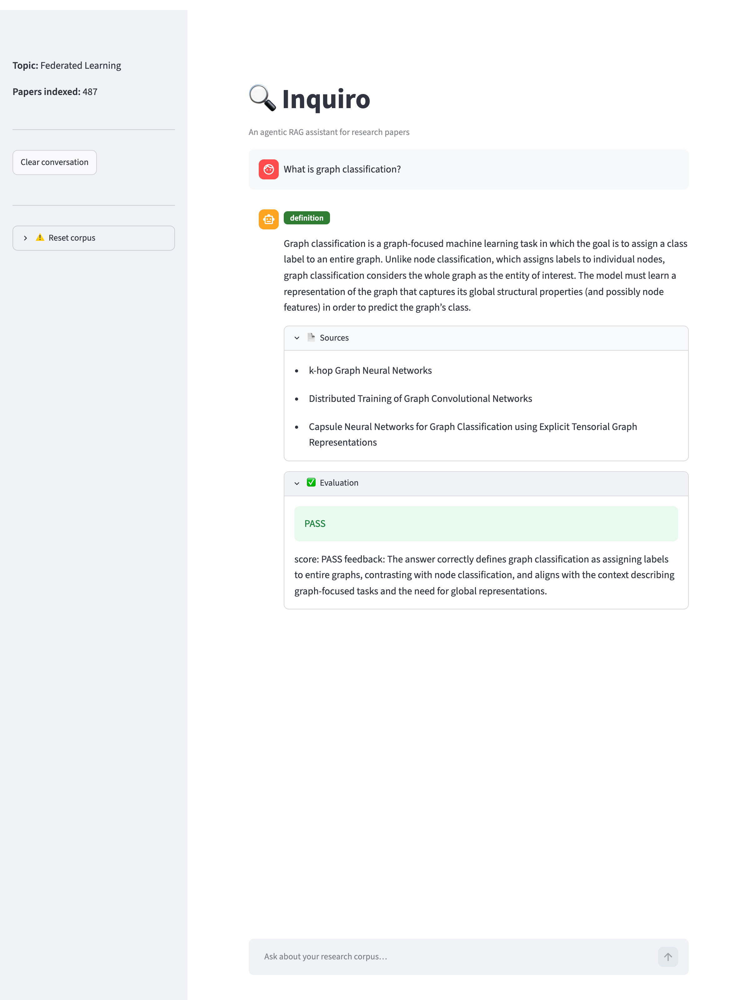

# Inquiro

Inquiro is an agentic RAG assistant that lets you explore any research topic through arXiv papers. Enter a topic, and it automatically downloads related papers, builds a searchable vector index, then answers your questions with grounded, source-cited responses.



## How it works

1. **Setup** — You enter a research topic. Inquiro fetches up to 40 papers from arXiv, reads them, and indexes them into a local ChromaDB vector store.
2. **Routing** — Each question is classified into one of three retrieval strategies:
   - `definition` — explain a concept
   - `comparison` — contrast methods or papers
   - `method` — explain how something works step by step
3. **Retrieval** — The appropriate retriever runs a tailored similarity search.
4. **Generation** — A Cohere LLM generates a grounded answer from the retrieved chunks.
5. **Evaluation** — An evaluator node checks whether the answer is supported by the context and returns a PASS/FAIL score with feedback.

## Stack

- **Orchestration:** LangGraph
- **LLM:** Cohere (`command-a-plus-05-2026`)
- **Embeddings:** HuggingFace (`sentence-transformers/all-MiniLM-L6-v2`)
- **Vector store:** ChromaDB
- **UI:** Streamlit
- **Paper source:** arXiv

## Project structure

```
inquiro/
├── graph.py        # LangGraph workflow (route → retrieve → generate → evaluate)
├── routing.py      # Classifies questions into definition / comparison / method
├── retrieval.py    # Route-specific Chroma retrievers
├── generation.py   # Grounded answer generation
├── evaluation.py   # PASS/FAIL answer grader
├── corpus.py       # PDF extraction, chunking, ChromaDB ingestion
├── downloader.py   # arXiv paper downloader
├── titles.py       # arXiv id → paper title resolution
├── resources.py    # LLM, embeddings, and vector store builders
├── state.py        # LangGraph state definition
├── config.py       # Paths and model constants
└── utils.py        # Shared formatting helpers
scripts/
├── download_papers.py   # CLI wrapper: download papers for a query
└── ingest.py            # CLI wrapper: chunk and index papers/
app.py              # Streamlit chat UI
```

## Setup

```bash
git clone https://github.com/PaMem27/Inquiro.git
cd Inquiro
python -m venv venv
source venv/bin/activate      # Windows: venv\Scripts\activate
pip install -r requirements.txt
```

Create a `.env` file with your Cohere API key:

```
COHERE_API_KEY=your_key_here
```

## Run the app

```bash
venv/bin/python -m streamlit run app.py
```

On first launch the setup screen will guide you through picking a topic, downloading papers, and building the index. After that the chat interface unlocks automatically.

## CLI usage

```bash
# Install as an editable package to get the inquiro command
pip install -e .

inquiro "What is knowledge distillation?"
python -m inquiro "How does magnitude pruning compare to structured pruning?"
```

## Scripts (optional — CLI alternative to the UI setup)

```bash
python scripts/download_papers.py   # download papers (edit query inside)
python scripts/ingest.py            # chunk and index papers/ into chroma_db/
```
